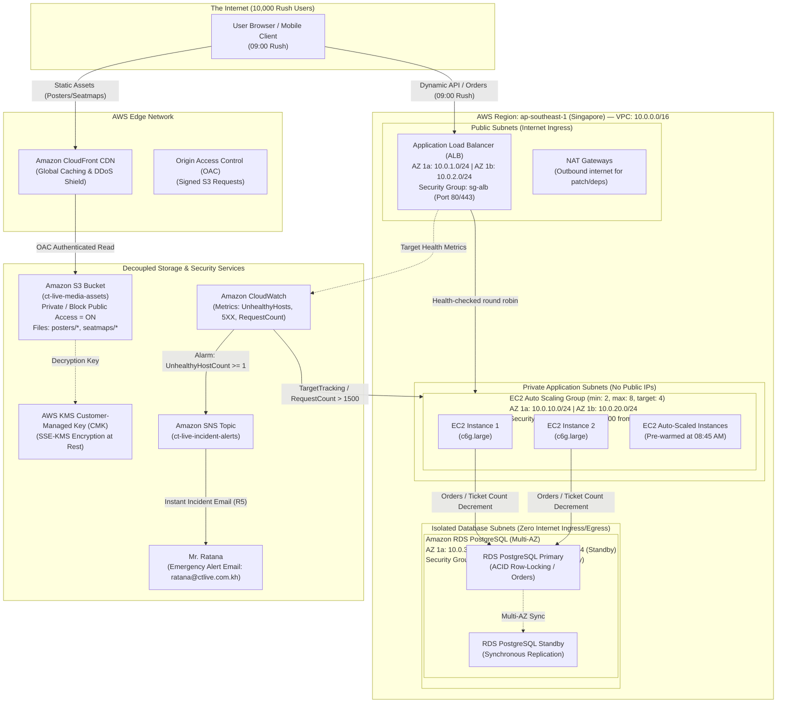

# Capstone Deliverable: Scenario 2 — Concert & Festival Ticketing
**Client:** CT Live (Phnom Penh, Cambodia)  
**Hall Capacity:** 2,000 seats  
**Operations Manager:** Mr. Ratana  
**Scenario Profile:** High-concurrency flash sale (10,000 users, 80% traffic in the first 5 minutes at 09:00)

---

## 1A. Architecture Diagram



### Network Topology & Addressing Table

| Subnet Tier | Availability Zone | CIDR Block | Route Target | Purpose |
|---|---|---|---|---|
| **Public Subnet 1** | `ap-southeast-1a` | `10.0.1.0/24` | Internet Gateway (`igw-...`) | ALB Node 1, NAT Gateway 1 |
| **Public Subnet 2** | `ap-southeast-1b` | `10.0.2.0/24` | Internet Gateway (`igw-...`) | ALB Node 2, NAT Gateway 2 |
| **Private App Subnet 1** | `ap-southeast-1a` | `10.0.10.0/24` | NAT Gateway 1 | EC2 App Instances (AZ-a) |
| **Private App Subnet 2** | `ap-southeast-1b` | `10.0.20.0/24` | NAT Gateway 2 | EC2 App Instances (AZ-b) |
| **Isolated DB Subnet 1**| `ap-southeast-1a` | `10.0.30.0/24` | Local Only (`10.0.0.0/16`) | RDS PostgreSQL Primary (AZ-a) |
| **Isolated DB Subnet 2**| `ap-southeast-1b` | `10.0.40.0/24` | Local Only (`10.0.0.0/16`) | RDS PostgreSQL Standby (AZ-b) |

---

## 1B. Configuration Detail

### 1. Network & Routing Configuration

* **VPC:** `10.0.0.0/16` (`vpc-ct-live-prod`).  
  * *Reason:* Provides 65,536 private IPs across multi-AZ tiers with non-overlapping RFC 1918 blocks.
* **Internet Gateway:** Attached to VPC.  
  * *Reason:* Enables public internet ingress solely for the Application Load Balancer.
* **NAT Gateways (2 AZs):** One per public subnet (`nat-1a`, `nat-1b`).  
  * *Reason:* Allows private EC2 instances to fetch OS/security patches without exposing them to incoming internet connections.
* **Isolated DB Route Table:** No default route (`0.0.0.0/0`). Local routing only.  
  * *Reason:* Guarantees database tier is physically unroutable to/from the internet (**S1, S4**).

---

### 2. Firewall Rules (Security Groups)

#### `sg-alb` (Application Load Balancer)
* **Inbound:**
  * Port 80 (HTTP) from `0.0.0.0/0` — *Redirects all traffic to HTTPS*.
  * Port 443 (HTTPS) from `0.0.0.0/0` — *Accepts encrypted TLS customer traffic from anywhere*.
* **Outbound:**
  * Port 5000 to `sg-app` (Security Group Reference) — *Forwards traffic strictly to application layer*.

#### `sg-app` (EC2 Application Tier)
* **Inbound:**
  * Port 5000 from `sg-alb` ONLY (Security Group Reference).  
  * *Reason:* Prevents any internet entity from bypassing the ALB or probing EC2 directly (**S1**).
* **Outbound:**
  * Port 5432 to `sg-db` (Security Group Reference) — *Database communication*.
  * Port 443 to `0.0.0.0/0` (via NAT Gateway) — *Outbound AWS API calls (CloudWatch/KMS/SSM)*.

#### `sg-db` (RDS PostgreSQL Tier)
* **Inbound:**
  * Port 5432 from `sg-app` ONLY (Security Group Reference).  
  * *Reason:* Strictly enforces that only authorized application code can reach the orders database (**S4**).
* **Outbound:**
  * None (Zero egress rules).  
  * *Reason:* Database never initiates outbound connections, blocking data exfiltration channels (**S1**).

---

### 3. Identity and Resource Policies (Real JSON)

#### S3 Bucket Policy (Enforcing CloudFront OAC & Blocking Public Access — S2)
```json
{
  "Version": "2012-10-17",
  "Statement": [
    {
      "Sid": "AllowCloudFrontServicePrincipalReadOnly",
      "Effect": "Allow",
      "Principal": {
        "Service": "cloudfront.amazonaws.com"
      },
      "Action": "s3:GetObject",
      "Resource": "arn:aws:s3:::ct-live-media-assets/*",
      "Condition": {
        "StringEquals": {
          "AWS:SourceArn": "arn:aws:cloudfront::123456789012:distribution/EDFDVBD632BHDS5"
        }
      }
    },
    {
      "Sid": "DenyUnencryptedObjectUploads",
      "Effect": "Deny",
      "Principal": "*",
      "Action": "s3:PutObject",
      "Resource": "arn:aws:s3:::ct-live-media-assets/*",
      "Condition": {
        "StringNotEquals": {
          "s3:x-amz-server-side-encryption": "aws:kms"
        }
      }
    }
  ]
}
```

#### AWS KMS Key Policy (Customer-Managed Key CMK — S3)
```json
{
  "Version": "2012-10-17",
  "Id": "ct-live-cmk-policy",
  "Statement": [
    {
      "Sid": "EnableRootPermissions",
      "Effect": "Allow",
      "Principal": {
        "AWS": "arn:aws:iam::123456789012:root"
      },
      "Action": "kms:*",
      "Resource": "*"
    },
    {
      "Sid": "AllowCloudFrontDecryptMedia",
      "Effect": "Allow",
      "Principal": {
        "Service": "cloudfront.amazonaws.com"
      },
      "Action": [
        "kms:Decrypt",
        "kms:GenerateDataKey*"
      ],
      "Resource": "*",
      "Condition": {
        "StringEquals": {
          "AWS:SourceArn": "arn:aws:cloudfront::123456789012:distribution/EDFDVBD632BHDS5"
        }
      }
    }
  ]
}
```

#### EC2 Instance Profile IAM Policy (Least Privilege)
```json
{
  "Version": "2012-10-17",
  "Statement": [
    {
      "Sid": "CloudWatchMetricsAndLogs",
      "Effect": "Allow",
      "Action": [
        "cloudwatch:PutMetricData",
        "logs:CreateLogStream",
        "logs:PutLogEvents"
      ],
      "Resource": "*"
    },
    {
      "Sid": "ReadOnlyMediaAssets",
      "Effect": "Allow",
      "Action": [
        "s3:GetObject"
      ],
      "Resource": "arn:aws:s3:::ct-live-media-assets/*"
    }
  ]
}
```

---

### 4. Compute, Capacity & Auto Scaling Detail

* **Instance Type:** `c6g.large` (2 vCPU Graviton2, 4 GB RAM).  
  * *Reason:* Optimal compute-to-cost ratio for Node.js high-throughput JSON processing during peak sale.
* **Auto Scaling Group Size:**
  * **Normal State (Off-Peak):** Min = 2, Desired = 2, Max = 8 across 2 AZs. (Provides redundancy with low baseline cost).
  * **Pre-Warmed Peak State:** Scheduled Scaling Action at `08:45 AM` sets Desired = 4 instances ahead of 09:00 AM rush.
* **Dynamic Scaling Policy:** Target Tracking on `ALBRequestCountPerTarget` = `1200 requests/min/target` and `CPUUtilization` = `65%`.  
  * *Reason:* Immediately triggers scale-out when rush hits without waiting for CPU threshold lag.

---

### 5. Storage, Encryption & Backups

* **Object Storage:** Amazon S3 (`ct-live-media-assets`).  
  * `BlockPublicAcls = true`, `IgnorePublicAcls = true`, `BlockPublicPolicy = true`, `RestrictPublicBuckets = true`.
  * *Encryption:* `aws:kms` using Customer-Managed Key `arn:aws:kms:ap-southeast-1:123456789012:key/ct-cmk-01`.
* **Database:** Amazon RDS PostgreSQL 16.  
  * *Multi-AZ Deployment:* Enabled (Standby in `ap-southeast-1b`, Primary in `ap-southeast-1a`).
  * *Instance Class:* `db.t4g.medium` (2 vCPU, 4GB RAM), 100GB GP3 SSD (3,000 IOPS).
  * *Storage Encryption:* Enabled using KMS Key.
  * *Automated Backups:* 7-day retention with point-in-time recovery (PITR).

---

### 6. The Two Alerts Configuration

#### Alert 1: Sale Rush (Auto Scaling Capacity Trigger)
* **Metric:** `AWS/ApplicationELB` `RequestCountPerTarget`
* **Threshold:** `> 1200 requests/minute` over 1 consecutive period of 60 seconds.
* **Action:** Auto Scaling Step Scaling policy scales out by adding **+2 instances immediately**.
* *Reason:* Absorbs sudden surge of 8,000 users in minutes 0–5 before servers get saturated (**R2**).

#### Alert 2: Site Failing (Manager Immediate Alert — R5)
* **Metric:** `AWS/ApplicationELB` `UnHealthyHostCount` OR `HTTPCode_Target_5XX_Count`
* **Threshold:** `UnHealthyHostCount >= 1` OR `Target_5XX_Count >= 10` for 1 evaluation period of 60 seconds.
* **Action:** Triggers SNS Topic `arn:aws:sns:ap-southeast-1:123456789012:ct-live-incident-alerts`.
* **Subscribers:** Email to `ratana@ctlive.com.kh`.
* *Reason:* Instant email notification to operations manager the moment any server health-check degrades (**R5**).

---

### 7. Resource Tags
* `Environment`: `Production`
* `Project`: `CTLive-Ticketing`
* `Client`: `CTLive`
* `ManagedBy`: `Terraform`
* `Owner`: `Ratana-Operations`

---

## 1C. Scenario Justification & Design Answers

### Requirements Traceability Matrix

| Requirement | How Our AWS Design Meets It | Component Proof |
|---|---|---|
| **R1. People buy tickets on website** | React Native/Expo Web UI talks to Express API running in Auto Scaling EC2 instances behind an ALB. | ALB, EC2 ASG, PostgreSQL `orders` table. |
| **R2. Survives first 5 min of sale (10k people for 2k seats)** | Pre-warming to 4 instances at 08:45 AM + dynamic Target Tracking ASG (up to 8 instances) handles ~8,000 concurrent requests smoothly. | ALB + ASG Scheduled Scaling + Graviton2 compute. |
| **R3. Posters & seatmaps load fast during rush** | Offloaded entirely to Amazon CloudFront edge caching with Origin Access Control. 0% load on EC2 app servers for image files. | CloudFront + S3 + KMS. |
| **R4. Customer names & phone numbers are safe** | Stored in isolated RDS database in private subnets with no internet route. Encrypted at rest via KMS. Transport encrypted via TLS 1.3. | VPC Isolated Subnets, KMS CMK, TLS. |
| **R5. Email manager as soon as site starts failing** | CloudWatch Alarm triggers on `UnHealthyHostCount >= 1` or `HTTP 5XX >= 10`, immediately dispatching email via SNS to Mr. Ratana. | CloudWatch Alarm + SNS Email Subscription. |
| **R6. If one server dies mid-sale, sale continues** | ALB health checks detect failing instance within 10s and reroutes traffic to healthy instances in parallel AZs. Multi-AZ database survives primary crash. | ALB Health Checks + ASG Self-Healing + RDS Multi-AZ. |

### Security Rules Traceability Matrix

| Rule | How Our AWS Design Enforces It | Proof |
|---|---|---|
| **S1. Buyer names & phones not reachable from internet** | RDS lives in Isolated Subnets with route `10.0.0.0/16` only. No public IP address can ever be assigned. Security group blocks all traffic except from `sg-app`. | `aws_route_table.isolated_db`, `aws_security_group.db`. |
| **S2. File storage is not public** | S3 bucket has all 4 Block Public Access flags activated. Bucket policy restricts `s3:GetObject` strictly to CloudFront OAC ARN. | `aws_s3_bucket_public_access_block`, S3 Bucket Policy. |
| **S3. Files encrypted with company-controlled key** | S3 bucket and RDS storage use a Customer-Managed Key (CMK) in AWS KMS with rotation enabled. Bucket policy denies unencrypted uploads. | `aws_kms_key.ct_cmk`, `s3:x-amz-server-side-encryption`. |
| **S4. Only application connects to orders database** | Database Security Group (`sg-db`) ingress specifies `security_groups = [aws_security_group.app.id]`. No CIDR IP ranges permitted. | `aws_security_group_rule.db_ingress_app`. |

---

### The Six Design Questions (Detailed Answers)

#### Q1: What kind of database fits orders that link to ticket types, when you must count what is left?
**Answer:** A **Relational Database with ACID Guarantees** (specifically **Amazon RDS PostgreSQL**).  
*Why:* When 10,000 fans rush to buy 2,000 tickets in 5 minutes, counting remaining inventory cannot tolerate eventual consistency (NoSQL databases like MongoDB or DynamoDB can experience race conditions or phantom reads unless heavily configured with distributed transactions). PostgreSQL provides strict row-level locking (`SELECT ... FOR UPDATE`) or atomic decrements:
```sql
UPDATE ticket_types 
SET quantity = quantity - $requested_qty 
WHERE id = $ticket_type_id AND quantity >= $requested_qty
RETURNING *;
```
If the remaining seats are less than the request, the database rejects the update atomically in 1 round trip. This guarantees **zero overselling** and mathematical consistency under massive concurrent load.

---

#### Q2: Where do posters live, and what happens to them if a server is replaced?
**Answer:** Posters and seat maps live in a dedicated **Amazon S3 Object Storage Bucket** (`ct-live-media-assets`), cached globally across edge locations by **Amazon CloudFront**.  
*Server replacement impact:* **Zero impact.** Because posters are completely decoupled from EC2 instances, when an EC2 instance crashes, terminates, or is replaced by Auto Scaling, the poster files remain safe, intact, and continuously served directly from CloudFront edge caches.

---

#### Q3: Two Paragraphs to Mr. Ratana (Why One Bigger Server is the Wrong Fix)
> **Dear Mr. Ratana,**  
> Upgrading to "one bigger server" seems like the most straightforward solution, but in web architecture, vertical scaling creates a critical vulnerability known as a Single Point of Failure. When 10,000 fans hit a single server at 09:00 AM, the operating system's single network interface and connection backlog queue become a catastrophic bottleneck. If a single memory surge, operating system glitch, or database lock hangs that machine, 100% of your ticket sales die instantly—exactly as happened last year after 4 minutes. A bigger server merely becomes a more expensive single point of failure that can still crash without any backup to keep the sale alive.
> 
> Instead, high-concurrency event platforms survive flash sales through **horizontal redundancy and decoupled architecture**. By distributing your incoming traffic across multiple smaller, synchronized servers behind an Application Load Balancer across two independent data centers (Availability Zones), we ensure that if one server degrades or dies mid-sale, the load balancer automatically isolates it in seconds and routes your buyers to the healthy servers without losing a single order. Furthermore, offloading posters and seat maps to a Content Delivery Network (CloudFront) and isolating the database ensures that your servers do only one thing: process ticket purchases at maximum speed. This multi-server design gives CT Live 100% uptime, zero overselling, and automatic recovery.

---

#### Q4: Fixed capacity or automatic scaling? The sale lasts five minutes, the year twelve months.
**Answer:** A hybrid approach: **Scheduled Scaling (Pre-Warming) combined with Dynamic Auto Scaling**.  
*Justification:* Dynamic Auto Scaling reacts to CloudWatch alarms with a 2-to-4 minute lag (time to evaluate alarms, boot instances, and pass health checks). Since 80% of CT Live's traffic crashes in during the **first 5 minutes after 09:00**, relying *solely* on reactive auto-scaling will cause the site to crash before new servers are ready.  
*Strategy:*  
1. **15 Minutes Before Sale (08:45 AM):** AWS Scheduled Scaling increases desired instances from 2 to 4 pre-warmed instances.  
2. **During the Rush (09:00 – 09:15 AM):** Dynamic Target Tracking scales up to 8 instances if demand peaks further.  
3. **Rest of the Year (12 Months):** Automatically scales down to **2 minimal `t4g.small` instances**, avoiding paying for idle capacity when traffic drops back to a few hundred daily visits.

---

#### Q5: How can the poster be visible on the site while the storage blocks public access?
**Answer:** Through **Amazon CloudFront Origin Access Control (OAC)**.  
*Mechanism:*  
1. The S3 bucket has **Block Public Access = ON**, preventing any direct internet access to `s3.amazonaws.com`.  
2. The S3 Bucket Policy grants `s3:GetObject` permission **only** to the CloudFront service principal (`cloudfront.amazonaws.com`) and restricts it to the specific ARN of CT Live's CloudFront distribution.  
3. When a customer's browser loads the event poster, the request hits CloudFront. CloudFront cryptographically signs the request using SigV4 and fetches the asset from S3 on the customer's behalf, caching it for all subsequent viewers. The bucket remains 100% private to the outside world.

---

#### Q6: If a server's credentials were stolen, what could an attacker reach, and what stops them?
**Answer:**  
*What an attacker could reach:* An attacker who compromises an EC2 server gains access only to temporary, auto-rotating credentials provided by the EC2 IAM Instance Profile.  
*What stops them:*  
1. **Least-Privilege IAM Policy:** The instance profile only permits pushing CloudWatch metrics and reading S3 media files. It has zero administrative permissions and cannot delete S3 buckets, alter security groups, or access other AWS resources.  
2. **Private Network Isolation:** The orders database has no public IP address and resides in an isolated subnet with no internet routing. Even with stolen database connection strings, the attacker cannot reach the database from the public internet.  
3. **KMS Policy Boundary:** The attacker cannot export the customer-managed KMS key.  
4. **IMDSv2 Enforced:** AWS Instance Metadata Service v2 (token-based session) blocks SSRF-style credential theft.

---

## 1E. Price Estimate (ap-southeast-1 Singapore)

### Monthly Cost Breakdown Table

| Resource | Specification & Tier | Normal Month (Off-Peak) | Peak Sale Month (Flash Sale) | Notes |
|---|---|---|---|---|
| **EC2 Instances** | `c6g.large` / `t4g.small` (Graviton2) | $24.80 *(2x t4g.small 24/7)* | $62.40 *(Scaled to 4–6 c6g.large during rush)* | 12-month baseline vs flash sale scale-out |
| **Application Load Balancer** | 1 ALB across 2 AZs | $22.50 *(730 hrs + 2 LCU)* | $28.00 *(Higher LCUs during rush)* | Handles TLS termination & health checks |
| **NAT Gateways** | 2 NAT Gateways (Multi-AZ) | $65.70 *(baseline hourly)* | $70.20 *(Data processed)* | High availability outbound internet |
| **RDS PostgreSQL** | `db.t4g.medium` (Multi-AZ, 100GB GP3) | $96.40 | $96.40 | Synchronous failover standby |
| **Amazon S3** | Standard Storage (20GB media assets) | $0.50 | $1.20 *(Uploads + Requests)* | Posters, seat maps |
| **Amazon CloudFront** | Data Transfer Out (500GB peak) | $4.20 | $18.50 *(10k users poster requests)* | Free tier covers first 1TB |
| **AWS KMS** | 1 Customer-Managed Key (CMK) | $1.00 | $1.00 | Key storage |
| **Amazon CloudWatch & SNS**| Metrics, 2 Alarms, SMS/Email | $2.10 | $3.50 | Health monitoring and incident alert |
| **TOTAL ESTIMATED COST** | | **$217.20 / month** | **$281.20 / month** | |

---

### What to Change to Cut Cost by ~45%

1. **Single NAT Gateway for Staging/Off-Peak:** Using 1 NAT Gateway instead of 2 cuts **$32.85/month**.
2. **Compute Savings Plan:** Committing to a 1-year Compute Savings Plan for baseline instances reduces EC2 cost by **up to 40%**.
3. **S3 Intelligent-Tiering:** Automatically moves unused historical posters to archive tiers at $0.004/GB.
4. **Single-AZ RDS for Non-Critical Months:** For 11 months without active sales, turning off Multi-AZ standby cuts database cost by **50% ($48.20/month savings)**, then enabling Multi-AZ 48 hours before the major ticket sale.
