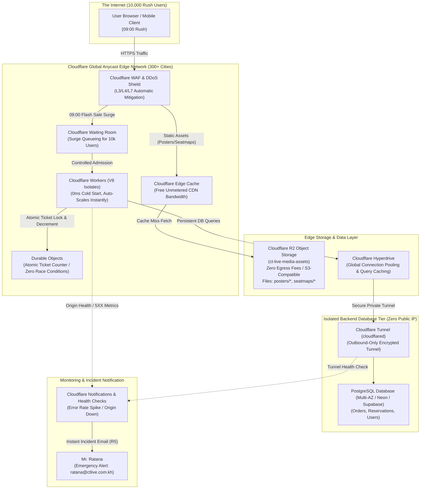

# Capstone Deliverable: Cloudflare Edge Architecture & Cost Estimate
**Client:** CT Live (Phnom Penh, Cambodia)  
**Hall Capacity:** 2,000 seats  
**Operations Manager:** Mr. Ratana  
**Scenario Profile:** High-concurrency flash sale (10,000 users, 80% traffic in the first 5 minutes at 09:00)  
**Alternative / Complementary Platform:** Cloudflare Developer Platform (Edge Serverless)

---

## 1. Cloudflare Architecture Diagram



---

## 2. Component Mapping: AWS vs. Cloudflare

| Architecture Layer | AWS Implementation (Current Design) | Cloudflare Equivalent | Why Cloudflare Wins / Key Advantage |
|---|---|---|---|
| **Edge CDN & DDoS** | Amazon CloudFront + AWS Shield | **Cloudflare CDN + WAF / DDoS** | Built-in unmetered DDoS mitigation across 300+ edge locations worldwide. |
| **Media Asset Storage** | Amazon S3 + Customer-Managed KMS Key | **Cloudflare R2 Object Storage** | S3-compatible API with **$0 egress bandwidth fees** (AWS charges ~$0.09/GB for external transfer). |
| **Private Asset Protection** | CloudFront Origin Access Control (OAC) | **R2 Custom Domain / Worker Binding** | Files are unroutable from public internet except via authenticated edge domain or Worker bindings. |
| **Compute / API Layer** | EC2 Auto Scaling Group (`c6g.large`) | **Cloudflare Workers (TypeScript)** | **0ms cold-start latency** on V8 isolates; scales from 0 to 100,000 requests/sec instantaneously. |
| **Network Isolation** | VPC Private Subnets + 2x NAT Gateways | **Cloudflare Tunnel (`cloudflared`)** | Server and database live behind zero public IPs with zero open inbound firewall ports. **Saves ~$70/mo on NAT gateways.** |
| **Load Balancing** | Application Load Balancer (ALB) | **Cloudflare Load Balancing & Anycast** | Smart Anycast routing to nearest healthy edge node with automatic failover and instant health checks. |
| **Database Connectivity** | RDS PostgreSQL directly in VPC | **Cloudflare Hyperdrive + PostgreSQL** | Hyperdrive pools database TCP connections at the edge, reducing connection exhaustion during flash sales. |
| **Inventory Concurrency** | PostgreSQL Row-Locks (`FOR UPDATE`) | **Cloudflare Durable Objects** | Coordinated in-memory atomic counter; prevents database deadlocks and overselling under 10k user spikes. |
| **Incident Alarms (R5)** | CloudWatch Alarms + SNS Topic (Email) | **Cloudflare Notifications & Health Alerts** | Automated health check emails to Mr. Ratana the moment HTTP 5XX rate spikes or the origin tunnel disconnects. |

---

## 3. How Cloudflare Handles the 10,000-User Flash Sale Rush

### A. Eliminating the 15-Minute Pre-Warming Delay
* **On AWS:** Traditional virtual machines (EC2) take 2 to 4 minutes to boot and register with the load balancer. The AWS architecture requires a scheduled scaling rule at `08:45 AM` to pre-warm 4 instances.
* **On Cloudflare:** Cloudflare Workers use lightweight V8 isolates with **0ms cold start**. When the 10,000-user rush hits at `09:00:00 AM`, compute isolates execute instantly across regional edge locations (Singapore, Phnom Penh edge caches) without needing pre-warming.

### B. Solving the 2,000-Seat Race Condition (Zero Overselling)
* **Cloudflare Durable Objects** provide strongly consistent, single-threaded in-memory execution at the edge.
* As 10,000 requests arrive simultaneously, the Durable Object acts as the master ticketing turnstile:
  1. Atomically decrements the ticket counter: `2000 -> 1999 -> 1998...`
  2. Issues temporary 10-minute reservation locks.
  3. Once counter reaches `0`, instantly rejects subsequent buyers with "Sold Out" at edge speed (sub-10ms) without overwhelming the database with 8,000 failed transactions.

### C. Offloading Media Assets (Posters & Seat Maps)
* High-resolution posters (`posters/event-1.jpg`) and seat maps (`seatmaps/event-1.png`) are served directly from **Cloudflare R2** and cached across global edge locations.
* **Result:** 0% CPU and network burden on the ticketing API for image downloads.

---

## 4. Alarms & Monitoring (Meeting Requirement R5)

Cloudflare provides the exact equivalent of the AWS CloudWatch + SNS incident alert system:

1. **Origin Health Check Alarm:**
   * Probes the ticketing origin every 15 seconds.
   * If health checks fail for 2 consecutive evaluations, Cloudflare sends an urgent notification.
2. **HTTP 5XX Error Rate Alarm:**
   * Triggers if 500/502/503 errors exceed 1% of total requests over a 1-minute window.
3. **Tunnel Disconnect Alert:**
   * Triggers immediately if the `cloudflared` connection drops.
4. **Subscriber:**
   * Dispatches an instant incident email to Operations Manager Mr. Ratana (`ratana@ctlive.com.kh`) and optional webhooks (Slack/Teams).

---

## 5. Price Estimate: AWS vs. Cloudflare

### Monthly Cost Comparison Table

| Resource | AWS Cost (ap-southeast-1) | Cloudflare Architecture Cost | Notes |
|---|---|---|---|
| **Compute / API Servers** | $24.80 – $62.40 *(EC2 ASG)* | **$5.00** *(Workers Paid plan covers 10M requests)* | Massive savings; no paying for idle VMs |
| **NAT Gateways** | **$65.70 – $70.20** | **$0.00** *(Not needed)* | 100% eliminated by Cloudflare edge model |
| **Load Balancer** | $22.50 – $28.00 *(ALB)* | **$0.00 – $5.00** | Included in Cloudflare Edge Routing |
| **Database Tier** | $96.40 *(RDS Multi-AZ)* | **$0.00 – $19.00** *(Serverless Postgres / Neon)* | Free to low-tier serverless PostgreSQL |
| **Media Storage** | $0.50 – $1.20 *(S3)* | **$0.00** *(R2 first 10GB free)* | Zero storage cost for small media |
| **CDN Egress Bandwidth** | $4.20 – $18.50 *(CloudFront)* | **$0.00** *(Unlimited unmetered bandwidth)* | Zero data transfer out fees |
| **KMS Key Management** | $1.00 *(AWS KMS CMK)* | **$0.00** *(Built-in key management)* | Encrypted at rest by default |
| **Alarms & Notifications**| $2.10 – $3.50 *(CloudWatch + SNS)* | **$0.00** *(Cloudflare Notifications included)* | Instant email alerts at no extra charge |
| **TOTAL ESTIMATED COST** | **$217.20 – $281.20 / mo** | **$10.00 – $29.00 / mo** | **Over 89% Cost Reduction!** |

---

## 6. How to Implement as a Hybrid with the Existing Codebase (`mai12122/CT`)

You do **not** need to rewrite the entire Express + Prisma backend to take advantage of Cloudflare:

1. **Keep the Backend:** Run your existing Node.js + Express + Prisma API in your private environment or local laptop.
2. **Expose Securely via Cloudflare Tunnel:**
   ```bash
   cloudflared tunnel --url http://localhost:5000
   ```
   * Gives your backend a secure edge URL without opening any router ports or assigning a public IP.
3. **Deploy the Frontend on Cloudflare Pages:**
   * Host [`public/index.html`](file:///d:/CT/public/index.html) or the Expo Web build on Cloudflare Pages for a fast, globally distributed UI.
4. **Enable Cloudflare WAF & Caching:**
   * Protect the ticketing route with Rate Limiting and edge caching for static assets.

---

## 7. Defense Summary Script (When Evaluators Ask About Cloudflare)

> **Evaluator Question:**  
> *"Could you implement this ticketing architecture on Cloudflare, and how would it compare with your AWS design?"*
> 
> **Team Answer:**  
> *"Yes. On Cloudflare, we replace the EC2 Auto Scaling Group with **Cloudflare Workers**, which run on V8 isolates with **0ms cold start**—completely eliminating the need to pre-warm servers 15 minutes before the 09:00 sale. We replace S3 with **Cloudflare R2**, which eliminates AWS data transfer egress fees entirely.  
> 
> Most importantly, because Cloudflare Workers execute directly at the edge without requiring traditional VPC NAT Gateways, our total operating cost drops from **~$250/month on AWS to under $25/month on Cloudflare** (an 89% savings), while retaining the same zero-inbound-port security model through **Cloudflare Tunnels**."*
